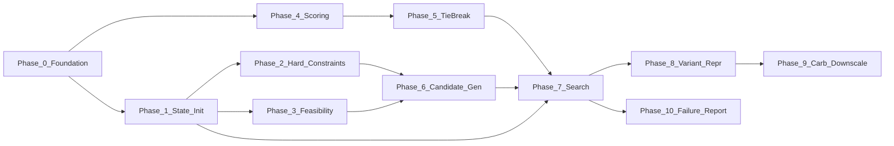

# Meal Plan Algorithm Implementation Roadmap

This roadmap implements the algorithm in [docs/MEALPLAN_SPECIFICATION_v1.md](docs/MEALPLAN_SPECIFICATION_v1.md) (Sections 1–11) without altering the specification, introducing new features, or mixing constraint logic with scoring logic. Optimization is explicitly deferred until after correctness is validated.

---

## Module Boundaries (Structural Rule)

- **Constraints module:** Implements hard constraints (HC-1 through HC-8) as pure predicates. No scoring. Input: recipe (or scaled variant), slot, day, state; output: pass/fail.
- **Feasibility module:** Implements FC-1 through FC-5 as forward-looking checks. No scoring. May use state and candidate set to decide prune/trigger backtrack.
- **Scoring module:** Implements Section 8 cost function only. No constraint or feasibility logic inside. Input: recipe/variant, decision point, state; output: score.
- **Search module:** Orchestrates decision order, candidate generation (which calls constraints and feasibility), greedy selection (which calls scoring and tie-breaking), validation, and backtracking. It composes the above modules and does not duplicate their logic.

---

## Phase 0: Foundation — Inputs, Reference Data, and Data Structures

**Objective:** Align program inputs and in-memory structures with Section 2 and Section 3 so that all downstream phases consume a single, spec-compliant representation. No search, no scoring, no constraint logic beyond input validation.

**Scope:**

- **User profile (Section 2.1):** Represent all spec fields (including `excluded_ingredients` as the single exclusion list, `micronutrient_targets`, `pinned_assignments`, `activity_schedule`, `enable_primary_carb_downscaling`, `max_scaling_steps`, `scaling_step_fraction`). Schedule structure per Section 2.1.1: per-day ordered list of slots, each with `time`, `busyness_level`, `meal_type`; max 8 slots per day.
- **Derived slot attributes (Section 2.1.2):** Implement derivation of `activity_context`, `is_workout_slot`, `time_until_next_meal`, `satiety_requirement`, `cooking_time_max` from user profile and schedule. These are computed at plan time, not stored as raw input.
- **Recipe pool (Section 2.2):** Recipe type with `id`, `name`, `ingredients`, `cooking_time_minutes`, `nutrition` (pre-computed). Add optional `primary_carb_contribution` (NutritionProfile) for later use; not used in this phase. Assume nutrition is pre-computed before the planner runs (input assumption in spec).
- **Reference data (Section 2.3):** UL table: load from `data/reference/ul_by_demographic.json`, merge with user overrides (existing [src/data_layer/upper_limits.py](src/data_layer/upper_limits.py) to be aligned if needed). Do **not** implement scalable carb source lists or loading in this phase; that is deferred to the optional-feature phase.
- **Planning horizon (Section 2.4):** D in [1, 7]; total decision points N = sum of slot counts over D days.
- **State structures (Section 3.1–3.3):** Define types for assignment sequence `(day, slot_index, recipe_id)`, daily tracker (all fields including `micronutrients_consumed` as a dict covering all nutrients needed for UL enforcement per spec, `used_recipe_ids`, `non_workout_recipe_ids`, `slots_assigned`, `slots_total`), and weekly tracker (`weekly_totals`, `days_completed`, `days_remaining`, `carryover_needs`). No behavior yet beyond construction and type contracts.

**Done when:** (1) User profile and schedule can be constructed and serialized/deserialized for tests; (2) derived slot attributes are computed correctly for arbitrary schedules and activity_schedule; (3) UL reference loading and merge with overrides matches spec; (4) state data structures exist and can be instantiated with the correct field types and shapes.

**Test before moving on:**

- Unit tests: schedule with 1–8 slots per day; validation that a day with 0 slots is rejected; derived attributes for slots with/without workouts and for overnight_fast_ahead.
- Unit tests: UL load by demographic and merge with overrides; null handling per spec.
- Unit tests: daily and weekly tracker creation and field types; assignment sequence type.

---

## Phase 1: State Initialization and Per-Meal Targets

**Objective:** Implement initial state S₀ (Section 3.5) and per-meal target distribution (Section 3.6). No search, no backtracking, no scoring. Constraint logic is limited to pinned pre-validation only.

**Scope:**

- **Initial state (Section 3.5):** Build `assignments` with pinned assignments in decision order; initialize daily trackers for days with pins (nutrition from pinned recipes, `non_workout_recipe_ids` from `is_workout_slot`); initialize weekly tracker from pinned nutrition; leave non-pinned decision points unassigned.
- **Pinned pre-validation:** Before building initial state, validate all pinned assignments against HC-1, HC-2, HC-3, HC-5, HC-8. If any violation, do not enter search; report FM-3 (Phase 8 will wire this to the public API).
- **Adjusted daily micronutrient targets (Section 3.4):** At start of day d, compute `adjusted_daily_target(n)` = base + carryover_needs(n) / days_remaining for each tracked micronutrient.
- **Per-meal target distribution (Section 3.6):** At a decision point (d, s), compute remaining calories/protein/fat/carbs and slots_left; base per-meal target = remaining / slots_left; apply activity-context adjustments (pre_workout, post_workout, high satiety) using the existing implementation’s multiplicative factors as normative (per Appendix C resolution #4).

**Done when:** (1) Given U, R, D and pinned_assignments, initial state is built and matches spec; (2) any pinned violation causes pre-validation to fail with a clear indication of which HC failed; (3) adjusted daily targets and per-meal targets are computable for any (d, s) and match the spec formulas.

**Test before moving on:**

- Tests: initial state with no pins; with pins on one day; with pins across multiple days; assignment order matches decision order.
- Tests: pre-validation rejects pinned recipe that fails HC-1, HC-2, HC-3, HC-5, or HC-8.
- Tests: adjusted_daily_target and per-meal targets for various carryover and slots_left values; activity-context adjustments applied as specified.

---

## Phase 2: Hard Constraints Module

**Objective:** Implement all hard constraints (Section 4) as a dedicated constraints module. Pure predicates only; no scoring, no feasibility logic. This module is the single place that answers “does this assignment violate a hard constraint?”

**Scope:**

- **HC-1:** Recipe contains no ingredient matching `U.excluded_ingredients` (normalized name match).
- **HC-2:** Recipe ID appears at most once per day (given daily `used_recipe_ids`).
- **HC-3:** Recipe `cooking_time_minutes` ≤ slot `cooking_time_max` (busyness 4 = no bound).
- **HC-4:** For each micronutrient with non-null resolved UL, `T_d.micronutrients_consumed[nutrient] ≤ resolved_UL[nutrient]` (daily tracker must include all nutrients with ULs per spec).
- **HC-5:** If `max_daily_calories` set, `T_d.calories_consumed ≤ max_daily_calories`.
- **HC-6:** Pinned assignments are enforced by state and pre-validation; no separate runtime checker beyond “is this slot pinned?”.
- **HC-7:** Enforced structurally by search (feasibility before scoring); no separate predicate.
- **HC-8:** For non-workout slot on day d (d > 1), recipe not in `T_{d-1}.non_workout_recipe_ids`; workout slots exempt.

API shape: functions or a small class that take (recipe or variant, slot, day, state, user_profile, resolved_UL) and return whether the assignment is allowed. Variants use same recipe ID for HC-2 and HC-8.

**Done when:** Every HC can be evaluated in isolation and in combination; results match the spec wording exactly (e.g., UL strict excess only; HC-8 exemptions for workout slots).

**Test before moving on:**

- Unit tests per HC: HC-1 (match/normalization), HC-2 (same day reuse), HC-3 (per busyness level), HC-4 (at UL vs over), HC-5 (at cap vs over), HC-8 (consecutive non-workout, workout exemption, day 1).
- Integration-style tests: multiple HCs applied together without scoring or search.

---

## Phase 3: Feasibility Constraints Module

**Objective:** Implement forward-looking feasibility checks FC-1 through FC-5 (Section 5) in a dedicated feasibility module. No scoring. This module is used during candidate generation and variant evaluation to prune candidates or trigger backtracking.

**Scope:**

- **FC-1:** After tentatively adding recipe to day: reject if over `max_daily_calories`; otherwise check that remaining calories can be plausibly distributed in remaining slots within ±10% daily tolerance (Section 6.5).
- **FC-2:** Analogous checks for protein, carbs (±10%), and fat (within [min, max]) for remaining slots.
- **FC-3:** For each nutrient with non-null UL, `T_d.micronutrients_consumed + recipe.nutrition ≤ resolved_UL` (incremental).
- **FC-4:** At start of day d (d > 1): for each tracked micronutrient, deficit vs `daily_RDI × D`; if deficit > days_left × max_daily_achievable(n), trigger backtrack. **Precomputation:** Before search, build table `max_daily_achievable(nutrient, slot_count)` per spec (sum of M largest values of nutrient n over distinct recipes in R).
- **FC-5:** After applying hard filters: if candidate set empty, trigger backtrack; and for each future slot on same day, ensure at least one eligible recipe exists under optimistic assumptions (trigger backtrack if any future slot has zero).

Implement FC-4 precomputation once per search (recipe pool and schedule slot counts fixed). Feasibility module receives precomputed table and state; it does not perform scoring.

**Done when:** (1) FC-1, FC-2, FC-3 correctly accept/reject a candidate for a given state; (2) FC-4 precomputation is correct for sample R and slot counts, and FC-4 triggers when deficit is irrecoverable; (3) FC-5 correctly detects empty candidate set and future-slot insufficiency.

**Test before moving on:**

- Unit tests: FC-1 (at tolerance, over, under); FC-2 per macro; FC-3 (at UL, over); FC-4 precomputation and trigger condition; FC-5 (empty set, future slot with no candidates).
- No scoring or search in these tests; use hand-built state and candidate lists.

---

## Phase 4: Cost Function (Scoring Module)

**Objective:** Implement the cost function (Section 8) and only the cost function. No constraint checks, no feasibility checks inside the scorer. Weights: Nutrition 40, Micronutrient 30, Satiety 15, Balance 15, Schedule 10 (normalized to sum 1.0). No preference component; preference is tie-breaking only (Phase 5).

**Scope:**

- **Composite score (Section 8.1):** Weighted sum of five components, each normalized [0, 100].
- **8.3 Nutrition Match:** Calories, protein, fat, carbs sub-scores; activity-context adjustments for protein/carbs (pre_workout, post_workout, etc.) per spec.
- **8.4 Micronutrient Match:** Uses `nutrients_still_needed`, `carryover_needs`, `nutrients_already_covered` from state; priority to nutrients with largest gaps; normalized to [0, 100].
- **8.5 Satiety Match:** High vs moderate satiety rules (fiber, protein, calorie density, etc.).
- **8.6 Balance:** Nutrient diversity, fat source diversity, macro trajectory.
- **8.7 Schedule Match:** Cooking time vs `cooking_time_max`; busyness 4 scoring per spec.

Input: recipe (or variant with recalculated nutrition), decision point (d, s), full state (for daily/weekly totals and adjusted targets). Output: single score. Deterministic: same inputs → same score.

**Done when:** All five components are implemented and weighted correctly; composite is in [0, 100]; no reference to constraints or feasibility inside the module.

**Test before moving on:**

- Unit tests per component (Nutrition, Micronutrient, Satiety, Balance, Schedule) with fixed state and recipe; expected score ranges or exact values where tractable.
- Determinism tests: same inputs produce same score repeatedly.
- No tests that mix scoring with constraint/feasibility logic.

---

## Phase 5: Heuristic Ordering (Tie-Breaking)

**Objective:** Implement tie-breaking cascade (Section 7.1) so that when multiple candidates have the same composite score, the ordering is deterministic and matches the spec. Scoring module remains separate; this phase only defines the comparator/cascade applied to the scored list.

**Scope:**

- Order: (1) higher micronutrient gap-fill coverage, (2) higher total deficit reduction for deficient nutrients, (3) more liked_foods matches, (4) lexicographically smaller recipe ID.
- Applied to the list of candidates after scoring; output is a fully ordered list (no ties left).

**Done when:** Given a list of (candidate, score) pairs with ties, the stable sort using the cascade produces the same order every time and matches the four rules in order.

**Test before moving on:**

- Unit tests: two candidates tie on score; cascade resolves by gap-fill, then deficit, then liked foods, then ID.
- Determinism: repeated application gives same order.

---

## Phase 6: Candidate Generation (Without Optional Features)

**Objective:** Implement candidate generation (Section 6.3, steps 1–7 only). Step 8 (Primary Carb Downscaling) is **not** implemented in this phase. This module uses the constraints module and feasibility module only; it does not score. Empty candidate set leads to “trigger backtrack” (handled in Phase 7).

**Scope:**

- Steps 1–7 in order: start from R; remove by HC-1, HC-2, HC-3, HC-5 (when applicable), HC-8 (when d>1 and non-workout slot); then remove by FC-1, FC-2, FC-3. FC-5: if after filtering the set is empty, or any future slot on same day would have zero candidates, signal “trigger backtrack” (caller will be the search orchestrator).
- Candidate set C(d, s) is the set of recipe IDs (or recipe + variant identity for later) that survive. No scoring inside this step; scoring is applied in Phase 7 after candidate generation.
- Distinguish “rejected due to calorie excess” for later use in Phase 9 (optional): when implementing step 7, record which recipes were dropped solely because of HC-5 or FC-1 calorie overflow, for use when step 8 is added.

**Done when:** For any (d, s) and current state, C(d, s) is computed correctly; all and only recipes passing HC-1, HC-2, HC-3, HC-5, HC-8, FC-1, FC-2, FC-3 are in the set; FC-5 conditions correctly trigger backtrack signal.

**Test before moving on:**

- Unit tests: with mock state and small R, verify filtering for each HC and FC in sequence; verify empty set and future-slot cases trigger backtrack signal.
- No backtracking implementation yet; tests only verify the candidate set and the backtrack signal.

---

## Phase 7: Backtracking and Search Orchestration (Core Algorithm)

**Objective:** Implement the full search loop (Section 6.1–6.2, 6.4–6.6), backtracking (Section 9), termination (Section 10), and failure reporting (Section 11). No Primary Carb Downscaling; no attempt-limit value tuning (expose as configurable parameter with a sensible default). Single-day mode (TC-4) is supported.

**Scope:**

- **Decision order (6.1):** Sequential days; within day, slots in chronological order by `time`.
- **Pinned slots (6.2):** At (d, s) if pinned, assign pinned recipe, update state, advance; no candidate generation or scoring.
- **Candidate generation:** Call Phase 6 implementation (steps 1–7). If backtrack triggered (empty or FC-5), invoke backtracking procedure.
- **Greedy selection (6.4):** Score all candidates via Phase 4; order by Phase 5; select first. Record selection (recipe ID; if variants are added later, variant index too).
- **Day completion (6.5):** When all slots of day d filled, run daily validation (macro ±10%, fat in range, UL, calorie ceiling). On failure: trigger backtrack (BT-2). On success: update weekly tracker, carryover_needs, advance to d+1.
- **Weekly validation (6.6):** When all D days filled and daily validation passed, check `W.weekly_totals[n] ≥ daily_RDI(n) × D` for each tracked n. On failure: trigger backtrack (BT-3). On success: TC-1, return plan. Sodium advisory: if weekly sodium > 200% prorated RDI, attach warning only.
- **FC-4:** At start of each day d > 1, run FC-4; if irrecoverable deficit, trigger backtrack (BT-4).
- **Backtracking (Section 9):** Implement procedure: find backtrack target (last non-pinned decision point with untried candidates); unwind state (do not modify pinned assignments); advance candidate pointer at target; re-enter forward. Day-boundary: reset day tracker for unwound day, update weekly tracker, invalidate candidate lists for that day and all later days (HC-8 consistency). Candidate list persistence: score once per (d, s), store sorted list and pointer; on backtrack within same day advance pointer only; on backtrack across day boundary regenerate list on next visit.
- **Termination:** TC-1 (success), TC-2 (exhaustion: no untried candidate at first non-pinned point), TC-3 (attempt limit reached), TC-4 (D=1: skip weekly validation, success/failure on daily only).
- **Failure reporting (Section 11):** For TC-2 and TC-3, return structured result with failure mode (FM-1 through FM-5) and the report fields specified in the spec (e.g., which day/slot, which constraints, best partial plan).

**Done when:** (1) A run with valid inputs and sufficient recipe pool produces a full plan satisfying all validations; (2) deterministic: same inputs produce same plan; (3) Pinned assignments are never backtracked and are validated upfront; (4) Backtracking is triggered correctly on BT-1–BT-4 and exhaustion/limit; (5) Single-day mode behaves per TC-4; (6) Failure reports include the required fields for the applicable FM.

**Test before moving on:**

- Integration tests: multi-day (D=2,3,7) with no pins; with pins; with backtracking triggered by daily or weekly validation failure; with FC-4 trigger; with empty candidate set (BT-1).
- Determinism tests: same U, R, D → same plan.
- Failure tests: insufficient pool (FM-1), daily infeasibility (FM-2), pinned conflict (FM-3), weekly micronutrient infeasibility (FM-4), attempt limit (FM-5); verify report structure.
- TC-4: D=1 success and D=1 failure (backtrack exhaustion).

---

## Phase 8: Assignment Representation for Variants (If Any)

**Objective:** Ensure that when scaled variants are introduced in Phase 9, the assignment sequence and state can represent “recipe r with variant index i” so that backtracking and reporting use the correct nutrition and identity. If the implementation already uses a (recipe_id, variant_index) or equivalent where variant_index is 0 for unscaled, this phase may be a small extension of the existing assignment type and state updates. No new algorithm behavior; only data representation.

**Scope:**

- Assignment type: support storing either recipe_id only (current behavior) or (recipe_id, scaling_step) so that state updates (daily tracker nutrition, used_recipe_ids, non_workout_recipe_ids) and final plan output can record which variant was chosen. HC-2 and HC-8 use recipe_id only (variants count as same recipe).
- Daily tracker: when adding a meal, accumulate nutrition from the chosen variant’s recalculated profile when variant_index > 0.

**Done when:** Assignment and state can represent and persist a chosen variant; backtracking and output use the right nutrition and ID for HC-2/HC-8.

**Test before moving on:**

- Unit tests: state update with variant (recipe_id, i) uses variant nutrition; used_recipe_ids and non_workout_recipe_ids use recipe_id only.

---

## Phase 9: Primary Carb Downscaling (Optional Feature)

**Objective:** Implement Section 6.7 and integrate it as step 8 of candidate generation. This phase is **optional** and is executed only when `enable_primary_carb_downscaling` is true. Core correctness (Phases 0–7) must be validated before this phase.

**Scope:**

- **Reference data:** Add `data/reference/scalable_carb_sources.json` (two keyed arrays: rice variants, potato variants). Load once at planner initialization when feature is enabled; treat as immutable during search.
- **Preconditions (6.7.2):** Apply only when feature enabled, slot has `sedentary` in activity_context, recipe was rejected due to calorie excess (HC-5 or FC-1), recipe has primary carb source (scalable rice/potato with `primary_carb_contribution`), slot not pinned.
- **Scaling mechanics (6.7.3):** K = max_scaling_steps, σ = scaling_step_fraction; q_i = q_original × (1 − i×σ), i=1..K; enforce q_i > 0 and K×σ < 1.0.
- **Nutrition recalculation (6.7.4):** contribution_original = r.primary_carb_contribution; contribution_scaled = contribution_original × (q_i/q_original); variant nutrition = r.nutrition − contribution_original + contribution_scaled.
- **Variant evaluation (6.7.5):** Each variant rechecked against all hard constraints and FC-1, FC-2, FC-3 using recalculated nutrition; only passing variants added to C(d, s).
- **Identity (6.7.6):** Variant identified by (r.id, i); for HC-2 and HC-8 treat as recipe r. Scoring and tie-breaking use variant’s recalculated nutrition.
- **Integration:** In candidate generation, after step 7, if feature enabled and slot sedentary and not pinned: collect recipes rejected for calorie excess only and that have primary_carb_contribution; generate up to K variants each; add passing variants to candidate set. Step 9 forms final C(d, s) as survivors from 7 plus variants from 8.

**Done when:** (1) With feature off, behavior unchanged from Phase 7. (2) With feature on, sedentary slot, and a calorie-excess recipe with primary carb source, valid variants are generated and can be selected; (3) Variants never exceed q_original; q_i > 0; only rice/potato; deterministic; no recursive scaling.

**Test before moving on:**

- Unit tests: variant nutrition formula; q_i bounds; rejection of non-sedentary / non–calorie-excess / no primary carb.
- Integration tests: one run with feature on where a scaled variant is chosen and plan is valid; HC-2/HC-8 with variant chosen; determinism.

---

## Phase 10: Failure Reporting and Sodium Advisory

**Objective:** Finalize the shape and content of failure reports (Section 11) and the sodium advisory so that all termination paths (TC-2, TC-3) and success path (TC-1 with optional warning) meet the spec’s “report shall include” requirements.

**Scope:**

- FM-1: day(s)/slot(s) unfillable; which hard constraints eliminate candidates; eligible count per slot.
- FM-2: day(s) failed; specific macro/UL violations; closest-to-valid plan.
- FM-3: conflicting pinned assignment; remaining budget; whether direct violation or downstream infeasibility.
- FM-4: deficient micronutrient(s); achieved vs prorated RDI; marginal vs structural.
- FM-5: assignments/backtracks attempted; best plan found; its validation failures; indication search was not exhaustive.
- Success path: if weekly sodium > 200% of daily_RDI × D, attach advisory warning; do not fail or backtrack.

**Done when:** Every failure mode and success-with-warning path returns a structured result that includes the specified fields; no new algorithm behavior.

**Test before moving on:**

- Tests that trigger each FM and TC-3; assert presence and correctness of required report fields.
- Test success with high sodium; assert advisory present and plan still valid.

---

## Optimization (Explicitly Deferred)

**Objective:** Not part of the implementation roadmap. After Phases 0–10 are complete and correctness is validated (including determinism and failure reporting), optimization (e.g., precomputation refinements, caching, attempt-limit tuning) may be undertaken in a separate effort. The specification does not prescribe performance; the roadmap prioritizes correctness and structure.

---

## Dependency Overview

---

## Test Milestones Summary

| Phase | Gate: test before proceeding                                         |
| ----- | -------------------------------------------------------------------- |
| 0     | Input/schedule/UL/state types and derived attributes                 |
| 1     | Initial state, pinned pre-validation, per-meal and adjusted targets  |
| 2     | Each HC and combined HCs (no scoring)                                |
| 3     | Each FC and FC-4 precomputation (no scoring)                         |
| 4     | All five score components, composite, determinism                    |
| 5     | Tie-breaking cascade, determinism                                    |
| 6     | Candidate set and backtrack signal (no search loop)                  |
| 7     | Full search: success, backtrack triggers, TC-2/TC-3/TC-4, FM reports |
| 8     | Variant representation in state and output                           |
| 9     | Carb downscaling on/off, variant selection, constraints on variants  |
| 10    | Report fields for all FMs and sodium advisory                        |

This roadmap is implementation-sequencing and structural only; it does not add features, change the algorithm, or combine constraint logic with scoring logic.