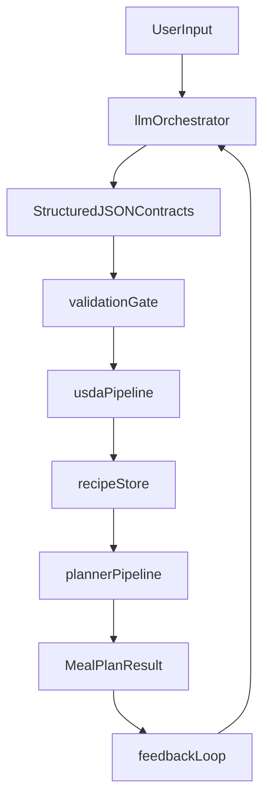

---

name: LLM Integration Execution Plan
overview: Integrate LLM capabilities as a deterministic pre/post-planner augmentation layer that never mutates search behavior inside phase7, always validates via existing USDA pipeline, and persists only validated artifacts into current recipe/ingredient stores.
todos:

- id: baseline-map
content: Document exact existing planner/ingestion call graph and failure surfaces in implementation notes.
status: pending
- id: llm-core
content: Create src/llm core client + strict schema module with JSON-only parsing and retry policy.
status: pending
- id: recipe-validation
content: Implement LLM recipe draft generation and USDA-backed validation/materialization pipeline.
status: pending
- id: recipe-persistence
content: Add deterministic recipe append repository with dedupe and ID generation.
status: pending
- id: ingredient-matcher
content: Implement ingredient matching module and API endpoint for normalized USDA-ready output.
status: pending
- id: feedback-loop
content: Implement planner orchestration wrapper for bounded failure-driven recipe generation retries.
status: pending
- id: nl-config
content: Implement natural-language config parser and map validated output into existing profile conversion flow.
status: pending
- id: tagging-filter
content: Implement recipe tagging metadata store and deterministic pre-planner filtering step.
status: pending
- id: tests
content: Add unit, integration, determinism, and success-rate tests for all new LLM flows.
status: pending
- id: ops-config
content: Add LLM key/settings loader and secure runtime configuration documentation.
status: pending
isProject: false

---

# LLM Integration Plan (Deterministic-First)

## Architecture Overview

The integration keeps the planner as the invariant core and adds LLM orchestration around existing ingestion/conversion boundaries.

- Planner source of truth remains unchanged in `[src/planning/planner.py](src/planning/planner.py)` and `[src/planning/phase7_search.py](src/planning/phase7_search.py)`.
- LLM runs only in:
  - pre-planner preparation (recipe generation, ingredient normalization, NL config)
  - post-failure adaptation (feedback loop)
- No LLM calls from inside `run_meal_plan_search()`.

## Phase 1 — Codebase Discovery Findings (Ground Truth)

- **Recipe creation/storage today**
  - Read path: `[src/data_layer/recipe_db.py](src/data_layer/recipe_db.py)` loads `{"recipes": [...]}` from JSON.
  - Source files: `[data/recipes/recipes.json](data/recipes/recipes.json)` (runtime), example schema in `[data/recipes/recipes.json.example](data/recipes/recipes.json.example)`.
  - Current behavior is read-only; there is no writer utility yet.
- **Ingredient structure today**
  - Canonical models: `[src/data_layer/models.py](src/data_layer/models.py)` (`Ingredient`, `IngredientInput`, `ValidatedIngredient`).
  - Normalization/validation: `[src/ingestion/ingredient_normalizer.py](src/ingestion/ingredient_normalizer.py)`, `[src/ingestion/ingredient_validator.py](src/ingestion/ingredient_validator.py)`.
- **Nutrition flow into planner**
  - Ingredient resolution via provider abstraction: `[src/providers/ingredient_provider.py](src/providers/ingredient_provider.py)`.
  - USDA path: `[src/ingestion/usda_client.py](src/ingestion/usda_client.py)` -> `[src/ingestion/ingredient_cache.py](src/ingestion/ingredient_cache.py)` -> `[src/providers/api_provider.py](src/providers/api_provider.py)`.
  - Conversion into planning recipes: `[src/planning/converters.py](src/planning/converters.py)` `convert_recipes()` with `NutritionCalculator` from `[src/nutrition/calculator.py](src/nutrition/calculator.py)`.
- **Planner failures surfaced today**
  - Failure modes FM-1..FM-5 emitted by `[src/planning/phase7_search.py](src/planning/phase7_search.py)`.
  - Structured diagnostics built in `[src/planning/phase10_reporting.py](src/planning/phase10_reporting.py)` (`MealPlanResult.report`, `failure_mode`, `stats`).
  - External surfaces: CLI `[src/cli.py](src/cli.py)` and API endpoint `[src/api/server.py](src/api/server.py)`.

## Phase 2 — Map LLM Features to Exact Integration Points

### 1) Recipe generation

- **Entry point**
  - New orchestration call in CLI/API before `extract_ingredient_names()` in `[src/cli.py](src/cli.py)` and `[src/api/server.py](src/api/server.py)`.
- **Inputs**
  - User preferences from `UserProfile` + optional target deficits from planner failure report.
- **Output (strict JSON)**
  - `GeneratedRecipeDraft` list (name, ingredients, instructions, optional tags).
- **Validation location**
  - New validation pipeline in `src/llm/recipe_validator.py` using:
    - `IngredientValidator` (`quantity/unit/name normalization`)
    - `APIIngredientProvider.resolve_all()` for authoritative nutrient lookup
    - `NutritionCalculator` recompute (ignore LLM nutrition claims)
- **Storage**
  - Append validated recipes into recipe store via new writer module (see Module Design), persisted to `[data/recipes/recipes.json](data/recipes/recipes.json)` or separate generated file.

### 2) Ingredient normalization (user text -> USDA match)

- **Entry point**
  - New endpoint/helper before provider resolution:
    - API: new endpoint adjacent to `/api/plan` in `[src/api/server.py](src/api/server.py)`
    - CLI: optional parsing mode in `[src/cli.py](src/cli.py)`
- **Inputs**
  - Free-form ingredient strings or partial structured inputs.
- **Output (strict JSON)**
  - `IngredientMatchResult` `{query, normalized_name, confidence, canonical_name, unit, quantity}`.
- **Validation location**
  - `IngredientValidator.validate()` + USDA lookup confidence gate in `CachedIngredientLookup`/`USDAClient` response quality checks.
- **Storage**
  - Accepted matches cached through existing ingredient cache in `[.cache/ingredients](.cache/ingredients)` and optional normalized-input cache file.

### 3) Planner feedback loop (generate recipes on failure)

- **Entry point**
  - New outer orchestrator around `plan_meals()` in CLI/API pipeline:
    - call planner once
    - inspect `MealPlanResult.failure_mode/report`
    - conditionally generate targeted recipes
    - retry planner with expanded pool
- **Inputs**
  - `MealPlanResult.report` (`deficient_nutrients`, failed constraints, closest_plan snapshot).
- **Output (strict JSON)**
  - `TargetedRecipeGenerationRequest` and resulting validated recipes.
- **Validation location**
  - Same strict recipe validation pipeline as feature 1.
- **Storage**
  - Persist generated validated recipes and mark provenance metadata (`source=llm_feedback`, deficit context).

### 4) Natural language -> planner configuration

- **Entry point**
  - New API endpoint (e.g., `/api/plan-from-text`) in `[src/api/server.py](src/api/server.py)`.
  - Optional CLI flag (e.g., `--prompt-config`) in `[src/cli.py](src/cli.py)`.
- **Inputs**
  - Raw user request string.
- **Output (strict JSON)**
  - `PlannerConfigJson` mapped into `UserProfile`/`PlanningUserProfile` fields.
- **Validation location**
  - New schema validator + existing conversion checks in `[src/planning/converters.py](src/planning/converters.py)` and planner argument guards in `[src/planning/planner.py](src/planning/planner.py)`.
- **Storage**
  - Optional persisted generated config under `config/` for reproducibility.

### 5) Recipe tagging/filtering

- **Entry point**
  - Pre-planner recipe pool filtering **at the service layer** after loading recipes and before `convert_recipes()`.
  - Frontend (current CLI / FastAPI + future UI) should call a stable filtering API rather than reimplementing this logic.
- **Inputs**
  - Recipe text + user preferences.
- **Output (strict JSON)**
  - Recipe tags `{cuisine, cost_level, prep_time_bucket, dietary_flags}`.
- **Validation location**
  - Enumerated-tag validator (closed sets), no freeform acceptance.
- **Storage**
  - Recipe metadata file keyed by recipe id (avoid mutating core recipe schema initially).

**NOTE FOR THIS PHASE (frontend alignment):**

- A separate branch will be building a full frontend in parallel (see Step 1 of `docs/NEXT_STEPS.md`).
- The integration points defined above for features (1)–(5) are **service-level contracts**, not UI-coupled endpoints:
  - All LLM features should be exposed via stable Python APIs and/or FastAPI routes under `src/api/server.py`.
  - The CLI and any new frontend should both consume these contracts, so UI changes do not alter planner behavior.
- When implementing the new frontend, prefer:
  - Calling the existing `/api/plan`, future `/api/plan-from-text`, `/api/ingredients/match`, and recipe-tagging endpoints.
  - Treating the LLM modules in `src/llm/` as backend services (no direct model calls from the frontend).
- This ensures we can freely evolve the UI while keeping:
  - the planner deterministic and constraint-driven, and
  - the LLM integration boundaries exactly where this roadmap defines them.

## Phase 3 — `src/llm/` Module Architecture

Create `[src/llm/](src/llm/)` with deterministic interfaces and strict schema parsing.

- `[src/llm/client.py](src/llm/client.py)`
  - `class LLMClient` wrapper for provider API calls.
  - `def generate_json(prompt: str, schema_name: str, temperature: float = 0.0) -> dict`
  - Enforce JSON-only response mode, timeout, retries, rate limiting.
- `[src/llm/schemas.py](src/llm/schemas.py)`
  - Pydantic models (single source of truth):
    - `RecipeDraft`, `IngredientDraft`, `IngredientMatchResult`, `PlannerConfigJson`, `RecipeTagsJson`, `FeedbackRequest`.
- `[src/llm/recipe_generator.py](src/llm/recipe_generator.py)`
  - `def generate_recipe_drafts(context: RecipeGenerationContext, n: int) -> list[RecipeDraft]`
- `[src/llm/ingredient_matcher.py](src/llm/ingredient_matcher.py)`
  - `def match_ingredient_queries(queries: list[str]) -> list[IngredientMatchResult]`
- `[src/llm/constraint_parser.py](src/llm/constraint_parser.py)`
  - `def parse_natural_language_config(text: str) -> PlannerConfigJson`
- `[src/llm/planner_assistant.py](src/llm/planner_assistant.py)`
  - `def suggest_recipes_from_failure(result: MealPlanResult, profile: PlanningUserProfile) -> list[RecipeDraft]`
- `[src/llm/recipe_validator.py](src/llm/recipe_validator.py)`
  - `def validate_and_materialize_recipe_drafts(drafts: list[RecipeDraft], provider: IngredientDataProvider) -> list[Recipe]`
- `[src/llm/repository.py](src/llm/repository.py)`
  - `def append_validated_recipes(recipes: list[Recipe], path: str) -> list[str]`
  - Deterministic ID generation and duplicate detection.

Dependencies on existing modules:

- `src/data_layer/models.py`
- `src/ingestion/ingredient_validator.py`
- `src/providers/api_provider.py`
- `src/nutrition/calculator.py`
- `src/planning/converters.py`
- `src/planning/phase10_reporting.py`

## Phase 4 — Data Contracts (Strict JSON)

Implement strict Pydantic schemas (reject extras, explicit enums, numeric bounds).

- **Recipe Output**
  - Required: `name`, `ingredients[]`, `instructions[]`
  - Ingredient requires: `name`, `quantity>0`, `unit` from supported unit set (`g, oz, lb, ml, cup, tsp, tbsp, large, scoop, serving, to taste`).
- **Ingredient Match Output**
  - Required: `query`, `normalized_name`, `confidence` (0.0-1.0).
  - Add internal-only fields: `canonical_name`, `validation_status`.
- **Planner Config Output**
  - Required: `days (1..7)`, `meals_per_day (1..8)`, `targets.calories`, `targets.protein`, `preferences.cuisine[]`, `preferences.budget` enum.

Contract enforcement:

- Parse raw LLM output with `model_validate_json` (or equivalent).
- Reject on first schema error, emit structured error object for retries/fallback.

## Phase 5 — Validation Layer Design

Validation pipeline order (mandatory):

1. **Schema validation** (`src/llm/schemas.py`) — shape and types only.
2. **Ingredient field validation** (`IngredientValidator`) — unit, quantity, canonical name.
3. **USDA resolution** (`APIIngredientProvider.resolve_all`) — all measurable ingredients must resolve.
4. **Nutrition recomputation** (`NutritionCalculator`) — derive authoritative nutrition from provider data only.
5. **Recipe feasibility checks**
  - reject if unmatched ingredients exist
  - reject if invalid normalized quantities
  - dedupe by ingredient fingerprint + instruction hash

Fallback behavior:

- Per-item rejection, continue batch where safe.
- If batch success rate below threshold, retry once with stricter prompt template.
- If still invalid, return deterministic failure to caller; planner runs unchanged with original pool.

## Phase 6 — Planner Feedback Loop Integration

Implement an outer retry coordinator that wraps existing planner calls.

- New orchestration function in `[src/planning/orchestrator.py](src/planning/orchestrator.py)`:
  - `def plan_with_llm_feedback(profile, base_recipes, days, llm_enabled, max_feedback_retries=3) -> MealPlanResult`
- Flow:
  1. Run `plan_meals()` once.
  2. If success -> return.
  3. If failure (`FM-1/FM-2/FM-4/FM-5` eligible), extract deficits from `result.report`.
  4. Call `planner_assistant.suggest_recipes_from_failure(...)`.
  5. Validate + persist recipes.
  6. Rebuild recipe pool via `RecipeDB` + `convert_recipes()`.
  7. Retry planner until success or retry limit.
- Deficit computation sources:
  - Primary: `build_report_fm4` deficient nutrients in `[src/planning/phase10_reporting.py](src/planning/phase10_reporting.py)`.
  - Secondary: `FM-2` constraint details and macro shortfalls from report payload.
- Retry controls:
  - hard cap (`max_feedback_retries`)
  - prevent duplicate recipe generation using recipe fingerprint set
  - deterministic candidate insertion ordering (sorted IDs)

## Phase 7 — API and Key Management

- Add LLM settings in config/env (do not commit secrets):
  - `LLM_API_KEY` (required when LLM enabled)
  - `LLM_BASE_URL` (optional)
  - `LLM_MODEL` (default)
  - `LLM_TIMEOUT_SECONDS`
  - `LLM_MAX_RETRIES`
  - `LLM_RATE_LIMIT_QPS`
- Add config loader in `[src/config/llm_settings.py](src/config/llm_settings.py)`.
- Wrapper behavior in `src/llm/client.py`:
  - exponential backoff for transient 429/5xx
  - bounded retries
  - deterministic failure codes returned to caller
  - structured logging without exposing API key

## Phase 8 — Incremental Implementation Plan

### Phase 1: Recipe generation + validation

- **Create**
  - `[src/llm/client.py](src/llm/client.py)`
  - `[src/llm/schemas.py](src/llm/schemas.py)`
  - `[src/llm/recipe_generator.py](src/llm/recipe_generator.py)`
  - `[src/llm/recipe_validator.py](src/llm/recipe_validator.py)`
  - `[src/llm/repository.py](src/llm/repository.py)`
- **Modify**
  - `[src/cli.py](src/cli.py)` to optionally augment recipe pool before planning.
  - `[src/api/server.py](src/api/server.py)` to expose optional recipe-generation trigger.
- **Tests**
  - `tests/test_llm_recipe_generator.py`
  - `tests/test_llm_recipe_validator.py`
  - `tests/test_llm_recipe_repository.py`
- **Expected outcome**
  - Validated LLM recipes can be added safely with USDA-backed nutrition.

### Phase 2: Ingredient matching

- **Create**
  - `[src/llm/ingredient_matcher.py](src/llm/ingredient_matcher.py)`
- **Modify**
  - `[src/ingestion/ingredient_validator.py](src/ingestion/ingredient_validator.py)` (reuse output contract, avoid logic duplication)
  - `[src/api/server.py](src/api/server.py)` add `/api/ingredients/match`.
- **Tests**
  - `tests/test_llm_ingredient_matcher.py`
  - integration extension in `[tests/test_ingredient_provider_integration.py](tests/test_ingredient_provider_integration.py)`
- **Expected outcome**
  - Natural ingredient text maps to validated canonical ingredients with confidence.

### Phase 3: Planner feedback loop

- **Create**
  - `[src/llm/planner_assistant.py](src/llm/planner_assistant.py)`
  - `[src/planning/orchestrator.py](src/planning/orchestrator.py)`
- **Modify**
  - `[src/cli.py](src/cli.py)` and `[src/api/server.py](src/api/server.py)` to call orchestrator instead of direct `plan_meals()` when enabled.
- **Tests**
  - `tests/test_planning_orchestrator_feedback.py`
  - add failure-driven loop cases in `[tests/test_phase7_search.py](tests/test_phase7_search.py)` and `[tests/test_planner_integration.py](tests/test_planner_integration.py)`
- **Expected outcome**
  - Controlled self-healing retries improve success rate without changing planner determinism.

### Phase 4: Natural language config

- **Create**
  - `[src/llm/constraint_parser.py](src/llm/constraint_parser.py)`
- **Modify**
  - `[src/data_layer/user_profile.py](src/data_layer/user_profile.py)` to support profile creation from parsed structured config object (not only YAML file path).
  - `[src/api/server.py](src/api/server.py)` add `/api/plan-from-text`.
- **Tests**
  - `tests/test_llm_constraint_parser.py`
  - converter validation additions in `[tests/test_converters.py](tests/test_converters.py)`
- **Expected outcome**
  - NL requests become validated planner-ready configs.

### Phase 5: Recipe tagging

- **Create**
  - `[src/llm/recipe_tagger.py](src/llm/recipe_tagger.py)`
  - recipe metadata store (e.g. `[data/recipes/recipe_tags.json](data/recipes/recipe_tags.json)`)
- **Modify**
  - `[src/cli.py](src/cli.py)`, `[src/api/server.py](src/api/server.py)` filter recipe pool by tags before conversion.
- **Tests**
  - `tests/test_llm_recipe_tagger.py`
  - planner-input filtering regression tests.
- **Expected outcome**
  - Better pre-filtered candidate pools while retaining deterministic planner behavior.

## Phase 9 — Testing Strategy

- **Unit tests**
  - strict JSON parsing and schema rejection for every `src/llm/`* module.
  - prompt-response sanitizer behavior (malformed JSON, missing fields, extra keys).
- **Integration tests**
  - LLM output -> validator -> USDA resolve -> `convert_recipes()` path.
  - failure-loop integration: forced FM-4 deficits produce targeted recipe generation attempts.
- **Determinism/regression tests**
  - same seed inputs and mocked LLM responses produce identical `MealPlanResult.plan`.
  - verify no API calls during search loop remains true (extend `[tests/test_ingredient_provider_integration.py](tests/test_ingredient_provider_integration.py)`).
- **Performance/success-rate tests**
  - benchmark baseline planner success rate vs feedback-enabled success rate on fixed scenario suite.
  - track attempts/backtracks from `MealPlanResult.stats` to ensure bounded overhead.

## Phase 10 — Delivery Sequence and Guardrails

- Implement in roadmap order already defined in `[docs/NEXT_STEPS.md](docs/NEXT_STEPS.md)`: recipe generation -> ingredient matching -> feedback loop -> NL config -> tagging.
- Non-negotiable safeguards from docs:
  - never trust LLM nutrition values
  - always validate via USDA
  - reject unmatched ingredients
  - normalize quantities before use
  - enforce retry limits and duplicate prevention
- Keep planner internals untouched for first iteration:
  - no changes to candidate generation/backtracking logic in `[src/planning/phase7_search.py](src/planning/phase7_search.py)`
  - only wrap before/after planner invocation.

